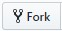
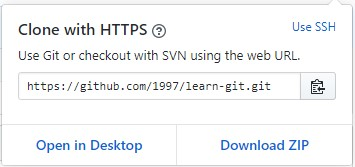

# CITS3403: Git Basics

- Install <b>Git</b> and <b>Git Bash</b> (Windows) or install Git standalone (Mac) from the following link: https://git-scm.com/downloads. Alternatively if you have Homebrew, run the command `brew install git`.

- Start by forking this repository on GitHub using the `Fork` button and selecting your account.

</img>

- Go to your newly created repository (should be visitable via `https://www.github.com/your-username-here/learn-git`) and `Clone` the repository by copying the link (https://github.com/1997/learn-git.git) or copying to clipboard.

</img>

Navigate to a place on your computer to store the repository, and run the command `git clone https://github.com/1997/learn-git.git`.

- Fetch all remote branches by running `git fetch`.

# Exercises

## Creating a Branch

Create a new branch using the `git checkout -b <branchname>`.
